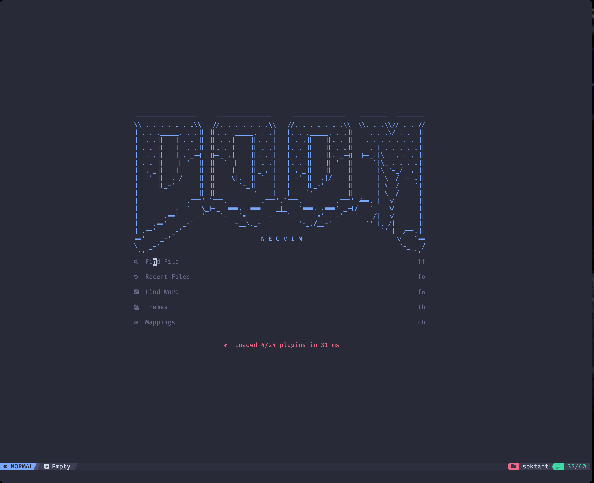

## 🛠️ How to become factually superior on typing code:

### If you aren't a vscode pomodoro ipad kid(RARE), make a backup of your current nvim and shared folder

```shell
mv ~/.config/nvim ~/.config/nvim.bak
mv ~/.local/share/nvim ~/.local/share/nvim.bak
mv ~/.local/state/nvim ~/.local/state/nvim.bak
mv ~/.cache/nvim ~/.cache/nvim.bak
```

### If you are, you probably doesn't have neovim installed, so take the pill below

#### Mac OS:
```
brew install neovim
```
#### Linux:
```
your-package-manager install neovim
```
#### Windows(are you ok buddy?)

##### **Install one of these before wishing to be productive on windows, lol:**
- [Linux Mint](https://linuxmint-installation-guide.readthedocs.io/en/latest/)
- [Arch Linux](https://wiki.archlinux.org/title/Installation_guide)


### Clone the repo

```shell
git clone https://github.com/sektant-gabe/my-vim-config.git ~/.config/nvim
```

#### Now just lock in, stop sharpening the God damn axe and go get things done mf

```shell
nvim
```

### BONUS:

**If you want a desktop vim app so you can set as default editor for files, install** [Neovide](https://neovide.dev/installation.html)
